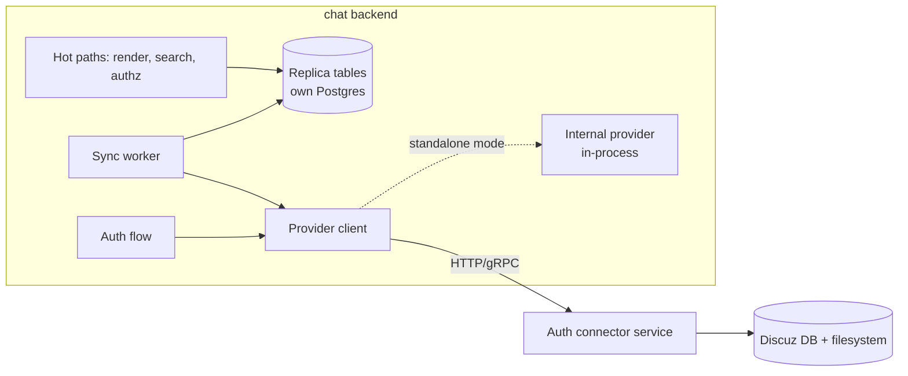

# Authentication and User Provider Design (v2)

Status: In-progress design. Sections marked **OPEN** are intentionally settled
slice by slice rather than up front.

## Problem Statement

wetty-chat currently hard-couples to Discuz: user profiles, groups, avatars, and
search are read directly from `discuz.common_member` and the Discuz filesystem,
and the initial session JWT is minted by an external Discuz/PHP web property
that shares the backend's signing key.

Fundamental requirements:

1. **Decouple from Discuz.** Identity, profile, and group data sit behind an
   abstraction, not behind direct table joins.
2. **Standalone mode.** The software must be able to run with no Discuz at all,
   using a built-in provider.
3. **Discuz remains source of truth** for identity, profile, and user groups.
   Throughout this document, "user group" means the provider's account-level
   member/permission classification (Discuz primary group, extension groups,
   admin role) — **not** chat groups/rooms, which are app-owned chat data and
   never involve the provider. Friend relationships are **app-owned** by
   wetty-chat (decided; earlier drafts considered provider-owned friends), so
   provider synchronization covers user info and profiles only.
4. **Token flexibility.** Support provider-issued login credentials (e.g. a
   Discuz-signed JWT), self-issued sessions, and generic OIDC-style third-party
   authentication.
5. **Performance.** Hot paths (message rendering, search, permission checks)
   must not depend on the availability or latency of an external source of
   truth.

Current-state constraints:

- `discuz.common_member` holds ~600k rows; only ~20k users are active in
  wetty-chat.
- Production clients hold long-lived JWTs today; migration must not log
  everyone out.
- Application tables store raw `i32` UIDs everywhere; rewriting them is out of
  scope. Existing UIDs are preserved.

## Design Principles

These rules resolve most detailed questions mechanically:

1. **One issuer.** The wetty-chat backend is the sole issuer of tokens its API
   accepts. Every external credential — a Discuz-signed JWT, an OIDC ID token,
   a password — is an authentication *proof* that is exchanged for a wetty-chat
   session. No external party ever holds the session signing key.

   This is a target-state invariant. During the legacy migration window the
   external PHP property still possesses the shared HS256 key and can therefore
   mint credentials accepted by the backend. Each implementation slice must
   state whether it narrows or preserves that temporary exception.
2. **One owner per data domain.** Provider-owned data (identity, profile,
   groups) flows one way: provider → replica. App-owned data (sessions,
   policies, chat membership, friends, preferences) is never written by the
   provider. No dual writes, no write-back — the provider contract is
   read-only.
3. **Hot paths read local data only.** Provider calls are confined to exactly
   two sites: login/refresh and the sync worker. Everything else reads the
   local replica.
4. **Provider knowledge stays behind the provider boundary.** The backend never
   sees Discuz table schemas, Discuz event formats, or Discuz filesystem
   layout — whether the provider runs in-process or as a remote connector.
5. **Data flows through one path.** All replica writes come from *pulling*
   through the provider interface and applying one idempotent upsert. Change
   events, when present, are hints about *when* to pull — they never carry
   profile data.

## High-level Architecture



Two orthogonal mechanisms provide decoupling and performance respectively:

- **The connector split** answers *where provider-specific code runs*. All
  Discuz knowledge (SQL against `common_member`, avatar filesystem layout,
  assertion verification) lives in a separate **auth
  connector** service that speaks a provider-neutral wire contract. Swapping
  providers means deploying a different connector; the backend does not change.
  The connector is deployed out-of-process from day one so the boundary cannot
  quietly rot.
- **The replica** answers *where hot-path reads come from*. The backend
  maintains a full local copy of tracked users' profile and group data in its
  own Postgres, kept current by a background sync worker. Hot paths never call
  the provider and never miss.

The **provider contract** is one interface with two implementations:

- `RemoteProvider` — client for the connector's wire contract (Discuz mode).
- `InternalProvider` — in-process Rust implementation backed by app-local
  account/credential tables (standalone mode; no connector deployed).

Both modes exercise identical read paths; only what the sync worker pulls from
differs.

Deliberately **not** cache-aside (Redis + TTL): TTL expiry makes hot-path
misses routine and uncorrelated with change, deletes still-valid data during
provider outages (the opposite of the desired freeze-and-serve behavior), and
cannot serve search or membership queries, which need the full population
indexed. At this population size a full Postgres replica is smaller, simpler,
and strictly more available. An in-process memory cache in front of the
replica remains a legitimate optimization for the hottest rows.

## Token Model

### Stance

wetty-chat deliberately issues **long-lived (non-expiring) session JWTs** so
users do not have to re-authenticate. This is an explicit, accepted security
tradeoff. Revocation is handled through a **per-user token generation**:

- Every session JWT carries the user's `token_generation` at issuance.
- Request auth validates the token's generation against the current stored
  value (via a small cached lookup, see [Hot-path validation](#hot-path-generation-check)).
- Password reset, provider-side disablement, and administrative "log out
  everywhere" all increment `token_generation`, invalidating every outstanding
  token for that user at once.

### Proof exchange

All login methods reduce to `authenticate(proof) → provider subject`, then a
wetty-chat session issuance:

| Method | Proof | Notes |
| --- | --- | --- |
| Discuz | Discuz-signed assertion JWT | Signed with a **dedicated keypair** (not the session key), short expiry, `aud` = wetty-chat. The PHP side keeps minting its token; it becomes a login credential, not an API credential. |
| OIDC third-party | ID token from code flow | Generic OIDC support; the connector/provider validates issuer, audience, nonce. |
| Internal | Username + password | Argon2id, rate-limited; direct exchange endpoint. |

### Legacy migration (no mass logout)

Existing production tokens (`{uid, cid, gen}`, minted partly by the external
PHP service with the shared key) continue to validate through a legacy decoder
for a measured window:

1. Backfill seeds a provider mapping for every existing wetty-chat UID
   (prerequisite).
2. Any time a legacy token hits a refresh-capable endpoint, it is silently
   reissued as a v2 session token — users never see a login screen.
3. Legacy-decode usage is metered; the legacy path is disabled when it
   approaches zero.
4. Sole custody of the session signing key moves to the backend; the external
   PHP service's minting role is retired (its signature becomes the Discuz
   assertion proof above, under a different key).

Note: `gen` in legacy tokens is hardcoded to `0` and has never been validated;
generation enforcement is entirely new machinery, not a tightening of existing
behavior. Legacy tokens are only revocable by disabling legacy acceptance
wholesale.

### Implementation status

**Backend slice 1 (implemented):** a bearer-only `POST /auth/refresh` exchanges
either a signature-verified legacy session or a valid v2 session for a v2
session JWT:

`{ver: 2, uid, cid, gen, iat}`

V2 tokens use HS256, require `kid = "v2-1"`, omit `exp` under the accepted
long-lived-session policy, and are issued with `gen = 0`. `typ`, `iss`, and
`aud` are deliberately omitted: regular HTTP and WebSocket connections use the
same session credential and trust boundary. Every listed v2 claim is required;
a token containing `ver` is always treated as versioned and never falls back
to legacy parsing. Issuance and verification live in one backend
`AuthTokenService`; request extractors and handlers do not parse JWT claims or
select token versions.

This deliberately small slice makes no frontend or WebSocket behavior change.

**Backend slice 1a (implemented):** in development builds, and in any build with
the exact environment override `ENABLE_DEBUG_AUTH=true`, unauthenticated
`POST /auth/dev-session` accepts a positive `uid` and required `X-Client-Id`
and issues the same v2 session shape. The route remains registered and documented,
but returns `404 Not Found` unless the gate stored in `AppState` is enabled. Setting
the override in a release deployment intentionally enables arbitrary-UID
impersonation and must therefore be treated as a privileged development configuration.
Existing `GET /users/auth-token` and `GET /ws/ticket` continue issuing
legacy-shaped tokens for client compatibility. Both old and new endpoints
currently reuse the existing shared signing key, as explicitly chosen for this
migration step. Consequently backend-only issuance is **not yet a security
property**; key separation remains required before the external PHP minting
role can be considered retired. Generation storage/enforcement and
legacy-decay metrics are also deferred.

**PWA slice 1b (implemented):** the React PWA resolves exactly one session before
React, Redux, or the WebSocket starts. It captures a `?token=` handoff, refreshes it
through `POST /auth/refresh`, and commits the returned v2 token; in Vite development
builds it instead mints a session through `POST /auth/dev-session`. The development
`X-User-Id` header is gone. A static splash covers the pre-render wait, bootstrap
requests time out after 10s, and unrecoverable outcomes render a localized
authentication-error page with Retry.

**Rollout order is backend first.** The PWA cannot start without `/auth/refresh`;
against an older backend that route returns `404`, which the client maps to a
bootstrap error and shows the failure page. Credentials are preserved, so clients
recover once the backend is deployed, but shipping the frontend first makes the app
unusable for every updated client in the meantime.

`__AUTH_REDIRECT_URL__` is currently `null` in every build. Production therefore
clears rejected credentials and renders the signed-out page instead of redirecting;
users re-enter through the external handoff link. Configure the redirect URL to
change that.

### Review observations to resolve with affected slices

These are recorded risks, not requirements to design every remaining phase now:

- **Signing-key custody:** move v2 to a backend-only key and make `kid` select
  from an explicit verification keyring before claiming the one-issuer
  invariant is complete.
- **WebSocket session transport:** WebSocket authentication intentionally uses
  the same reusable session credential as HTTP API authentication. Send it only
  inside the initial authentication message over WSS, never in a URL or logs.
  `/ws/ticket` is therefore a compatibility issuance endpoint rather than a
  separately scoped or short-lived ticket.
- **PWA migration ordering:** token refresh must not race landing/query-token
  adoption and overwrite a newly selected account. Token persistence must also
  avoid a cookie/memory versus IndexedDB partial-write state.
- **Account state ownership:** keep provider identity state separate from
  app-owned administrative suspension, and define multi-identity aggregation.
- **UID allocation:** the internal sequence-above-imported-max rule can collide
  with a later first-login Discuz UID; choose a collision-free allocation or an
  explicit single-provider migration invariant before creating the schema.
- **Synchronization correctness:** define complete fingerprint-batch semantics,
  distinguish confirmed not-found from transient errors, and budget sweep
  interval, runtime, and auth-cache TTL against one end-to-end revocation SLO.
- **Session semantics:** decide whether sessions remain purely stateless with
  per-user revocation only or require individual device/session management
  before extending the v2 claim contract.

## Data Ownership

| Data | Owner | Write path | wetty-chat read path |
| --- | --- | --- | --- |
| Identity, account state | Provider | Provider-internal | Replica |
| Profile (name, avatar, gender) | Provider | Provider-internal | Replica |
| User groups / roles (permission classification) | Provider | Provider-internal | Replica (normalized subjects) |
| Friends (future) | wetty-chat | App | App tables |
| Sessions, token generation | wetty-chat | App | App tables |
| Policies, effective permissions | wetty-chat | App | App tables + cached subjects |
| Chat groups/rooms, membership, moderation | wetty-chat | App | Existing tables |
| Preferences, activity (`user_extra`) | wetty-chat | App | Existing tables |
| Group display colors | wetty-chat | App | Overlay keyed by subject ID |

## Replica and Sync

### Scope: tracked users only

The replica contains **only tracked users** — those with a
`(provider_id, subject) → uid` mapping. A mapping is created by first
successful login, or by the migration backfill (which seeds every UID already
present in wetty-chat data). The ~600k-row Discuz directory is *not*
replicated; dormant forum accounts enter the system only when they first log
in, at which point the login path fetches them fresh.

Consequences, accepted deliberately:

- **Search finds only activated users.** This is a behavior change from
  searching all of `common_member`. Nobody currently visible disappears
  (backfill covers them); new Discuz users become searchable after first login.
- **No deletion handling.** Rows are inserted and updated, never removed.
  Provider-side *disablement* is an account-state update (caught by the sweep),
  not a deletion. A row physically vanishing from Discuz freezes its replica
  entry and fails its future logins; no active handling.

### Sync worker

The security-relevant guarantee: a provider-side change (disable, group change)
is enforced locally within a configurable target of **~5 minutes**.

- **Fingerprint sweep (primary mechanism).** Every 2–5 minutes the sync worker
  asks the connector for `(subject, fingerprint)` over the mapped-subject set
  (~20k rows, one query). The fingerprint is a hash the **connector** computes
  over the normalized profile DTO — display name, account state, avatar
  version, full group set, admin role — so any material change is visible in
  the diff. The backend compares opaque strings and batch-fetches full profiles
  only for changed subjects.
- **Change events (optional, additive).** If the Discuz side later publishes
  change events (e.g. via Kafka), the **connector** consumes them and exposes
  them as a provider-neutral `list_changes(cursor)`; for Kafka the opaque
  cursor is the partition offsets, keeping the connector stateless. Events
  carry only "subject S changed" — the worker reacts by pulling through the
  normal path. Events reduce latency from minutes to seconds; they are never
  load-bearing for correctness (producer-side misses, retention gaps, and
  ordering are all absorbed by the sweep). V1 ships sweep-only.
- **Sync state.** Per provider: opaque change cursor, last sweep start/finish/
  status, consecutive-failure counter. Alert when
  `now() - last_sweep_completed` exceeds the propagation target — during a
  provider outage the replica freezes, existing sessions keep working, and this
  alert is the staleness signal.

### Avatar freshness

Avatar version is part of the fingerprint (sourced from mtime or
`avatarstatus`, resolved once per refresh by the connector), replacing today's
per-read filesystem probe. Avatar changes therefore propagate on the sweep
cadence rather than immediately — accepted tradeoff.

## Data Model

All tables live in the chat backend's Postgres. `app_users` and
`user_profiles` are deliberately split: the former is app-owned truth, the
latter is disposable derived data — `user_profiles` could be truncated and
rebuilt from a sweep without losing anything.

```sql
app_users            -- app-owned identity spine
  uid                INTEGER PRIMARY KEY,   -- Discuz: preserved subject-as-uid;
                                            -- internal provider: allocated from a
                                            -- sequence starting above imported max
  state              user_state NOT NULL,   -- active | disabled | suspended
  token_generation   INTEGER NOT NULL DEFAULT 0,
  subject_set_version BIGINT  NOT NULL DEFAULT 0,
  created_at, updated_at

provider_identities  -- the mapping; defines "tracked user" and the sweep population
  uid                REFERENCES app_users,
  provider_id        TEXT NOT NULL,
  subject            TEXT NOT NULL,          -- opaque; Discuz uses decimal uid string
  state              identity_state NOT NULL,
  fingerprint        TEXT,                   -- last applied provider fingerprint
  last_auth_at, last_synced_at,
  UNIQUE (provider_id, subject),
  UNIQUE (uid, provider_id)

user_profiles        -- pure replica; never written by app features
  uid                INTEGER PRIMARY KEY REFERENCES app_users,
  display_name       TEXT NOT NULL,
  normalized_name    TEXT NOT NULL,          -- LOWER(BTRIM(...)); index with
                                             -- text_pattern_ops for prefix search
  gender             gender NOT NULL,        -- includes explicit unknown
  avatar_ref         TEXT,
  avatar_version     TEXT,
  synced_at

auth_subjects        -- normalized provider groups/roles
  id                 INTEGER PRIMARY KEY,    -- Discuz group IDs preserved where possible
  provider_id, kind, external_key,
  display_label, provider_version,
  UNIQUE (provider_id, kind, external_key)

user_auth_subjects
  uid, auth_subject_id, is_primary, synced_at,
  UNIQUE (uid, auth_subject_id)              -- plus reverse-lookup index

auth_subject_extra   -- app-owned presentation overlay (chat colors, ...)

provider_sync_state
  provider_id PRIMARY KEY, change_cursor,
  last_sweep_started, last_sweep_completed, last_sweep_status,
  consecutive_failures
```

UID assignment is **provider-specific**: the Discuz provider preserves its
decimal subject as the app UID (so existing message/membership rows keyed on
Discuz UIDs stay correct, including for users who first log in after the
backfill); only the internal provider allocates from the sequence.

### The single upsert

Every replica write — sweep, event-hinted fetch, live fetch at login — goes
through one idempotent transaction, given one fetched provider profile:

1. `SELECT … FOR UPDATE` the `provider_identities` row (serializes concurrent
   writers, e.g. a sweep racing a login, per user).
2. **Fingerprint short-circuit:** stored fingerprint matches → commit, exit.
3. Replace the `user_profiles` row.
4. Diff the subject set against `user_auth_subjects`; only if it differs:
   replace memberships, increment `subject_set_version`, invalidate the authz
   cache entry.
5. Apply identity state. On transition to disabled: update identity/app state
   and **increment `token_generation`** — provider disablement and password
   reset revoke tokens through the same mechanism.
6. Store the new fingerprint and `last_synced_at`; commit.

First-login provisioning is the same transaction with an insert step in front:
insert `app_users` + `provider_identities`; concurrent first logins are
resolved by the `(provider_id, subject)` unique constraint — the loser
re-reads the mapping instead of allocating a second UID.

### Hot-path generation check

Request auth needs `(state, token_generation)` per UID: one tiny indexed read,
cached in-process with a short TTL (30–60s). Worst-case
disable-to-rejection ≈ sweep interval + cache TTL. The TTL is the only
revocation lag knob and must be chosen consciously.

## Provider Contract

Transport-neutral DTOs; implemented by the remote connector client and the
in-process internal provider. Conceptually:

```rust
trait IdentityProvider {
    fn id(&self) -> &str;
    fn capabilities(&self) -> ProviderCapabilities;

    /// Verify a provider-specific proof; returns identity facts only.
    /// Never allocates a UID, never returns app permissions.
    async fn authenticate(&self, req: AuthenticateRequest)
        -> Result<AuthenticatedIdentity, ProviderError>;

    async fn fetch_profile(&self, subject: &Subject)
        -> Result<ProviderProfile, ProviderError>;
    async fn fetch_profiles(&self, subjects: &[Subject])
        -> Result<Vec<ProviderProfile>, ProviderError>;

    /// (subject, fingerprint) over a given subject set — the sweep primitive.
    async fn list_fingerprints(&self, subjects: &[Subject])
        -> Result<Vec<(Subject, Fingerprint)>, ProviderError>;

    /// Capability-gated change hints; cursor is opaque to the backend.
    async fn list_changes(&self, cursor: Option<Cursor>)
        -> Result<(Vec<Subject>, Cursor), ProviderError>;

    async fn health(&self) -> ProviderHealth;
}
```

Internal-provider account lifecycle (registration, password reset, bootstrap
admin) is a provider-owned management surface, **not** part of the common
contract — but it is required for the standalone goal and must be scheduled,
not deferred indefinitely. **OPEN:** its design and phase.

**OPEN:** the connector wire contract — concrete endpoints, service-to-service
authentication (mTLS or equivalent), deadlines/retries/circuit breaking,
error-code mapping, and versioning.

## Failure Behavior

| Situation | Login / refresh | Hot-path reads | Authorization |
| --- | --- | --- | --- |
| Provider/connector unavailable | Fail (retryable error) | Replica serves last-known data indefinitely | Cached subjects + local policies |
| Provider disables a user | Refused | Replica updated by sweep | `token_generation` bump rejects outstanding tokens within sweep + TTL |
| Sweep falling behind | Unaffected | Staleness grows; alert fires | Staleness grows |

## Open Items (next design slices)

Settled so far: architecture and topology, token stance and legacy migration
approach, data ownership, sync design, replica schema and upsert. Still open,
roughly in intended order:

1. **Session issuance flow** — v2 JWT claims, exchange endpoints, the
   Discuz-assertion format, OIDC redirect flow details (state/nonce/PKCE,
   exchange-code binding), WebSocket tickets.
2. **Connector wire contract** — endpoints, service auth, error semantics,
   versioning.
3. **Internal provider account lifecycle** — registration, reset, bootstrap
   admin; required for standalone.
4. **Migration and rollout phases** — backfill mechanics, dual-decode window,
   shadow comparison, client migration (PWA token stores, WS ticket adoption),
   feature flags and rollback.
5. **Security hardening checklist** — carry over the applicable items from the
   v1 review (proof/credential redaction, rate limiting, audience separation,
   key rotation, audit events).
