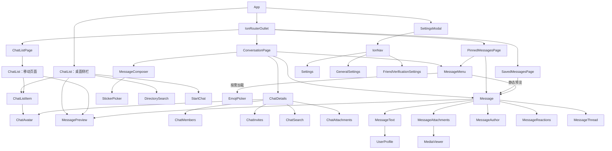

# Components

组件按界面职责组织。查询成员与聊天数据来自共享 Store；对话消息来自页面提供的 ConversationStore；滚动、菜单、表单与按钮等待状态由相应组件持有。固定文案和展示配置位于 HTML 模板。

## 组件树

图中的同名节点表示组件类型，不表示多个页面共享同一个组件实例。MessageMenu 中的 Message 仅作预览，不产生嵌套菜单。

## 应用与列表

| 组件         | 输入、输出或入口                                                                             | 局部状态                                                                   | 服务依赖与职责                                                                                                                                                              |
| ------------ | -------------------------------------------------------------------------------------------- | -------------------------------------------------------------------------- | --------------------------------------------------------------------------------------------------------------------------------------------------------------------------- |
| App          | 浏览器 popstate、分栏可见性、路由栈事件                                                      | 登录 loading/error、分栏可见性、sidebarSelection、浏览器是否已播放返回动画 | SessionStore 初始化身份；Router 协调 Ionic 默认页面动画；解析路由并向侧栏传递列表选择，装配分栏和设置弹窗                                                                   |
| ChatListPage | 路由输入 tab、archived、requestHistory；Ionic 进入/离开事件                                  | listActive、宽屏媒体查询状态                                               | 为移动列表提供 selection/active，宽屏仅创建聊天占位页；离开时驱动子查询清理                                                                                                 |
| ChatList     | 输入 selection、active；点击分类、设置、刷新和续页                                           | 首次展示 ready、下拉 refreshing；其他行、排序、加载和计数为派生状态        | ChatListStore 提供列表/计数/好友请求，ChatStore 提供聊天操作，DraftStore 提供草稿，Preferences 决定话题展示，SessionStore 提供当前用户，ConversationNavigation 定位当前对话 |
| ChatListItem | entry、startActions、endActions、actionsAlwaysVisible；输出 selected；投影 title/preview/end | pendingAction、操作 error                                                  | 通用列表行；执行父组件提供的 run，管理滑动收起、局部 spinner 和错误；不注入业务 Store                                                                                       |

App 和 ChatListPage 根据布局创建桌面或移动 ChatList，隐藏布局不创建列表实例。页面转场期间的实例共享 Store 中的查询。组件选择 `chats(archived)`、`threads(archived)`、`friendRequests(history)` 和归档计数查询；active 控制其消费者生命周期。

ChatList 在 TypeScript 中派生行数据、排序时间和操作回调，在模板中提供按钮文案、图标与布局。群组/好友过滤和共同时间范围展示属于这个组件；协议游标属于 Store。

## 消息页面

| 组件               | 路由输入                                                     | 局部状态                                                                                                                            | 服务与子组件                                                                                                                                                                |
| ------------------ | ------------------------------------------------------------ | ----------------------------------------------------------------------------------------------------------------------------------- | --------------------------------------------------------------------------------------------------------------------------------------------------------------------------- |
| ConversationPage   | id、threadId、message、reply；十进制路由 ID 转成 SnowflakeID | 页面进入上下文、滚动/触摸活动、定位目标、固定未读边界、底部状态、输入与回复预览、发送状态、话题按钮状态、当前置顶选择和置顶读取错误 | 提供 ConversationStore；消费 ChatStore 的读状态、订阅、置顶与标题、DraftStore、Preferences、SessionStore、Connection 和 ConversationNavigation；驱动 Message 与 MessageMenu |
| PinnedMessagesPage | id、threadId                                                 | 活跃版本、loading/failed                                                                                                            | 消费 ChatStore 的共享 ChatPins，派生置顶消息数组，驱动 Message 和 MessageMenu；无 ConversationStore                                                                         |
| SavedMessagesPage  | 无                                                           | 活跃版本、收藏列表与游标、loading/failed、removingSavedId/removeFailed                                                              | 直接使用 SavedMessagesService；快照经 savedMessageContent 交给 Message；无消息菜单与 ConversationStore                                                                      |

ConversationPage 的 `rows` 来自 `messageRows`，保存消息引用及日期/分组标志。同一作者连续消息之间留 2px，分组之间留 8px；分组间距使用 first/last，与是否显示所有头像无关。`selectedPin` 从置顶列表和 selectedPinId 派生。pendingNavigation 同时用于置顶、引用、历史导航的位置反馈。右下角下箭头显示共享 ChatStore 的未读数，离开底部约 40px 或仍有较新分页时出现，录音时隐藏。点击引用时页面记录来源消息 ID，点击下箭头逐层返回来源；没有返回记录时定位最新。滚动经过来源、回到最新或离开页面会清理对应记录。按钮与角标节点保持挂载，显示切换不改变滚动容器结构。

SavedMessagesPage 的收藏数据是快照，`savedMessageContent` 仅映射 Message 需要的展示字段。收藏使用 `interactive=false`，来源、日期、查看原消息和取消收藏按钮由页面展示。PinnedMessagesPage 的置顶行保留回复、定位、话题和消息菜单交互。

页面通过 Message 的输出处理用户意图：回复交给输入区或导航，jump 交给定位，openThread 交给路由，menu 和 react 交给本页 MessageMenu。页面模板读取 `menu.busy()`，在 toolbar 展示菜单关闭后的请求进度。

## 消息与菜单

| 组件               | 输入                                                                                                             | 输出/公开操作                                                                                                   | 持有状态与边界                                                                                                                        |
| ------------------ | ---------------------------------------------------------------------------------------------------------------- | --------------------------------------------------------------------------------------------------------------- | ------------------------------------------------------------------------------------------------------------------------------------- |
| Message            | message、own、first/last、showAllAvatars、preview、interactive、canReply、canOpenThread、jumpingTo、jumpDisabled | reply、jump、openThread、menu、react                                                                            | 长按、水平拖动、回复填充反馈和点击抑制属于局部状态；姓名、颜色、头像、引用、媒体和话题展示为派生值；不读取业务服务                    |
| MessageAuthor      | sender、own                                                                                                      | 无                                                                                                              | 作者姓名、性别图标等静态展示                                                                                                          |
| MessageAttachments | message、overlayTime                                                                                             | 无                                                                                                              | 派生附件类型与尺寸；failed 记录当前内容的资源加载失败；由浏览器读取媒体 URL                                                           |
| MessagePreview     | message 的摘要字段                                                                                               | 无                                                                                                              | 正文或媒体类型摘要；用于列表、引用、回复预览和置顶栏                                                                                  |
| MessageReactions   | reactions、own、external、preview                                                                                | react(emoji)                                                                                                    | 展示数量与个人选择；请求和状态更新由上层负责                                                                                          |
| MessageThread      | info、preview                                                                                                    | open                                                                                                            | 话题回复计数和入口                                                                                                                    |
| MessageMenu        | messages、chatId、threadId、canReply、showAllAvatars                                                             | reply(message)、edit(message)、openThread(rootId)；open(selection)、reactTo(message, emoji)、reset()；只读 busy | 所选消息 ID/锚点、确认意图、最近表情、提示、忙碌状态、表情面板与菜单位置；提供 MessageActions，使用 ChatStore、SessionStore 和 Router |
| EmojiPicker        | 模板中的中文静态配置                                                                                             | chosen(emoji)                                                                                                   | 封装 emoji-picker-element；代码和中文搜索数据按需加载                                                                                 |

MessageMenu 从父页面传入的 messages 数组中解析选中的消息，因此编辑、撤回和表态更新可以反映到已打开的菜单。selection 只保存定位所需的 ID、元素、矩形和分组信息；确认框保存具体消息与用户确认的置顶意图。

菜单内的职责分工：

- 复制和复制链接直接在点击处理期间发起 Clipboard 写入，以保留 Safari 的用户激活状态。
- 回复与打开话题通过输出交给父页面。
- 置顶和取消置顶先确认，再调用 当前 ChatPins.set。
- 收藏、撤回和表态调用 MessageActions；撤回需要确认，表态受个人及消息总种类限制。
- Modal、Alert、Toast 和最近表情由 MessageMenu 持有。页面离开调用 reset，清空界面操作并使旧异步反馈失效；同一组件实例的最近表情保留。
- 菜单位置根据消息锚点、内容尺寸、visualViewport 与安全区域计算。EmojiPicker 展开状态仅影响菜单内部。

## 设置

| 组件                       | 输入或入口                    | 局部状态                                                              | 依赖与职责                                                                                          |
| -------------------------- | ----------------------------- | --------------------------------------------------------------------- | --------------------------------------------------------------------------------------------------- |
| SettingsModal              | Router 导航结束；弹窗关闭角色 | open 由 URL 派生                                                      | Router、Location；管理 `/settings` 的浏览器历史与 IonModal；IonNav 装配内部页面                     |
| Settings                   | IonNav 根页面                 | updateResult                                                          | SessionStore 展示用户，PushNotifications 管理通知，AppUpdates 管理更新；打开通用/好友验证子页或收藏 |
| GeneralSettings            | IonNav 子页面                 | 无额外数据状态                                                        | Preferences；直接修改话题与头像展示偏好                                                             |
| FriendVerificationSettings | IonNav 子页面                 | verification、Signal Form、loading/loadError、saving/saveError、saved | FriendsService；进入时读取好友验证配置，校验和保存由组件完成                                        |

设置弹窗的浏览器地址是 `/settings`，内部匹配保留聊天列表路由并带 settings 查询参数，聊天列表不因弹窗导航更换内容。弹窗内的子页面使用 IonNav。设置主页面不显示退出登录按钮；通知和更新支持性由对应服务提供。

## 状态和传参约定

- 共享服务保存跨页面仍有消费者的数据；菜单、按钮、滚动和表单状态由组件持有。
- 同一个对象可通过多个输入和派生行传递引用，无需仅为节省内存改成 ID。持久化回复目标和需要解析最新消息的菜单选择使用 ID。
- `Preferences → 页面 → Message/MessageMenu → 展示子组件` 传递头像偏好；展示组件不隐式读取全局偏好。
- 子组件通过 output 表达意图；父组件负责具体导航或转交操作。业务请求不会散布到消息气泡、作者、摘要、表态按钮和话题入口中。
- Ionic 路由页面离开时可能保留实例，清理依据页面生命周期；普通组件资源清理依据 DestroyRef。

请求和缓存规则见[数据流](data-flow.md)，spinner、按钮禁用和错误反馈见[加载与操作反馈](loading-indicators.md)。

## 资料、搜索与消息输入

| 组件            | 输入／输出                                                 | 局部状态和请求                                                                     |
| --------------- | ---------------------------------------------------------- | ---------------------------------------------------------------------------------- |
| StartChat       | 创建、加入或加好友模式；可选邀请码                         | 群名称、邀请码、邀请预览及提交状态；创建群或兑换邀请成功后打开聊天                 |
| DirectorySearch | 搜索文字、是否只搜索用户                                   | 已加入群组与用户结果；群组支持继续分页，旧搜索结果不覆盖新查询                     |
| UserProfile     | 用户摘要                                                   | 好友关系、验证方式、验证文本与操作状态；添加、删除、拉黑和私聊入口                 |
| ChatDetails     | chatId、threadId、threadRoot；输出 closed                                                     | 群资料、好友关系、编辑表单、当前子视图和请求状态；静音消费 ChatStore，共用侧栏和 modal 内容                       |
| ChatMembers     | chatId                                                     | 成员搜索、分页、权限与操作状态；管理员可修改角色或移除成员                         |
| ChatInvites     | chatId                                                     | 邀请列表、类型、限制、过期时间与分享目标；目标群来自已加入群组查询                 |
| ChatSearch      | chatId                                                     | 关键词、相关度／最新排序、搜索结果和偏移量；结果可定位原消息                       |
| ChatAttachments | chatId                                                     | 图片／视频／文件分类、消息游标与附件列表                                           |
| ChatLink        | 旧式资料、邀请码或消息链接                                 | 解析链接并打开对应页面或弹窗；邀请只预览，加入需要点击确认                         |
| MessageText     | 正文、mentions、是否交互                                   | 同步解析名字和链接；点击提及才打开用户资料，不补取名字后替换消息文字               |
| MessageComposer | chatId、text 双向绑定、editing、disabled；输出 Composition | 附件、压缩与上传进度、面板选择和提及候选；父页面拥有草稿、回复、编辑目标和发送请求 |
| StickerPicker   | 可选贴纸／贴纸包、embedded、disabled；输出 selected        | 收藏、贴纸网格、底部包切换及长按菜单；输入栏内嵌和独立弹窗共用展示                 |
| MediaViewer     | 图片集合和初始位置                                         | 当前图片、放大状态与切换手势；不修改消息区域高度                                   |

消息输入框显示可读的提及名字，DraftStore 与发送正文保存 `@[uid:UID]`。编辑文本时只保留完整、未被修改的提及标记。编辑已发送消息使用独立编辑目标，editText 与未发送文字、回复目标相互独立，取消或保存编辑不需要从 DraftStore 恢复输入。输入和回复选择只修改页面局部状态；离开会话、切换会话及页面进入后台时才更新 DraftStore 和聊天列表中的草稿。

长按菜单在隐藏状态下完成测量，使用最终宽度计算可用预览高度；操作区预留两行，权限读取不会改变菜单整体高度。消息行的桌面回复按钮只在整行 hover 时出现；触摸端左滑显示填充图标，达到 60px 后放大反馈，松手触发回复。切换聊天分类只动画列表内容。

Ionic 动态弹窗会向组件注入保留属性 `modal`。手写组件中的 ModalController 字段使用 `modals`，避免控制器被弹窗元素覆盖。

VoiceRecorder 是输入栏的子组件，持有手势、麦克风、录音文件、预览 URL 和计时。active 双向绑定控制输入栏显示；submitted 交给 MessageComposer 上传，discarded 清除待发送语音。松开保存，向左取消，向上松开发送；权限请求结束后才到达的录音不会在松手后启动。

回复／编辑预览由 ConversationPage 投影到输入框内部。回复预览采用与消息引用相同的 3px 竖线、14px 字号、1.4 行高与 4px/8px 内边距，使用同一作者亮暗色。右侧关闭按钮与下方贴纸按钮的宽度、图标尺寸和水平中心一致。话题 toolbar 使用根消息的 MessagePreview，与聊天列表相同；根消息优先复用消息区间或 ChatStore，缺失时读取单条消息。订阅、归档和取消归档共用一个状态按钮。

## 响应式聊天资料

ConversationPage 在 lg（992px）及以上默认显示右侧 ChatDetails，toolbar 的侧栏按钮控制收起和展开；较窄屏幕使用圈 i 按钮和内联 IonModal。侧栏开关、小屏 modal 开关与屏幕尺寸属于页面局部状态，切换到大屏会关闭小屏 modal。侧栏随会话 ID 重建，编辑和请求状态不会带入另一个聊天；离开当前页面不保留隐藏的资料面板。

ChatAvatar 接收头像展示数据和尺寸，ChatListItem 使用 48px，ChatDetails 使用与 Settings 相同的 88px 居中头像。群聊话题右上角显示发起人头像，私聊话题使用话题图标。话题标题复用父页面传入的根消息与 MessagePreview，不另建根消息缓存。

ChatDetails 的侧栏和 modal 均无 toolbar；右上角提供独立关闭按钮，子视图的返回入口位于内容区。首屏是头像、标题、横排搜索／静音／退出群组或删除好友／更多，以及图片、视频、文件三个 tab。更多中包含用户资料、聊天收藏、群成员、邀请与编辑入口。媒体、搜索和成员列表仍由各自组件管理分页；只有显示相应内容时才请求。操作按钮在请求期间禁用，静音和移除操作在原图标位置显示 spinner。

消息作者名、引用作者名和头像占位背景沿用旧版按显示名字计算的 31 倍字符 hash，在浅色／深色各七种颜色中选择同一索引。自己发送的气泡中，作者名和引用名字使用气泡的对比色。
