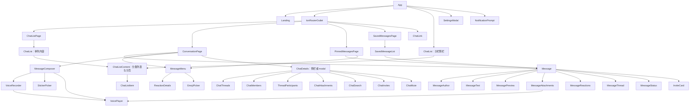

# 组件

组件负责本地交互和显示；跨页面数据通过共享 Store 读取。表格只描述输入输出、字段归属和依赖，产品行为见[需求](requirements.md)，请求协议见[数据流](data-flow.md)，尺寸见[外观](appearance.md)。

## 组件关系

收藏、搜索、附件定位、话题列表、好友资料、创建/加入和通知通过 ConversationNavigation.open 关闭弹层并进入会话；消息定位由目标页面执行，同一路由的重复定位通过 requests$ 交给已有页面，不保存额外导航状态。

MediaViewer、ChatDetails 的用户资料模式、StartChat 和 StickerPicker 的独立模式由 ModalController 打开。设置内部页面由 IonNav 管理。简单展示组件不为数据传递新建服务。

## 根布局与聊天列表

| 组件               | 输入、输出与局部字段                                                                                            | 数据依赖                                                                              |
| ------------------ | --------------------------------------------------------------------------------------------------------------- | ------------------------------------------------------------------------------------- |
| App                | landingPage、启动 loading/error、splitPaneVisible、sidebarSelection、浏览器返回动画状态；iOS 可见视口监听与清理 | SessionStore；路由决定单列页面，分栏分类选择保存在根组件                              |
| NotificationPrompt | 首次通知询问；弹窗开关、允许按钮等待状态、toast 引用                                                            | PushNotifications                                                                     |
| ChatListPage       | 路由分类/归档范围；active；接收 openList 并导航                                                                 | 将 selection 和 active 传给单列 ChatList                                              |
| ChatList           | selection、active → openList；搜索词、原生 segment 与内容 ID                                                    | SessionStore、Connection、PushNotifications；控制分类面板与菜单，设置入口保留授权手势 |
| ChatListContent    | selection、active → openList；刷新状态、查询消费者、显示准备状态、派生列表行                                    | ChatListStore、ChatStore、DraftStore、Preferences、SessionStore                       |
| ChatListItem       | entry、button、两侧 actions、actionsAlwaysVisible → selected；pendingAction、操作失败与滑动引用                 | 接收行数据和回调，不自行读取聊天数据                                                  |
| ChatAvatar         | entry、size                                                                                                     | 由输入派生头像、占位和话题角标，无请求                                                |
| DirectorySearch    | query、usersOnly、selecting → selected；群/用户结果、群游标和请求版本                                           | GroupsService、UsersService；选择用户或打开资料                                       |
| ChatLink           | 路由参数；failed                                                                                                | 解析旧链接、按需查询消息/用户，打开目标页面或弹窗                                     |

ChatListContent 的行是共享资料、查询成员和草稿的派生结果。分类内容各自保留滚动位置，仅当前分类激活查询和续页。tab、归档范围属于父组件；操作进度属于被点击的行。固定入口与独立角标不参与初次内容等待。

## 消息页面

| 组件               | 输入与局部字段                                                                                               | 数据依赖与传递                                                                                                                                        |
| ------------------ | ------------------------------------------------------------------------------------------------------------ | ----------------------------------------------------------------------------------------------------------------------------------------------------- |
| ConversationPage   | id、threadId、message、reply；进入上下文、定位目标、未读边界、滚动锚点、输入/回复/编辑、置顶选择、信息栏开关 | 提供 ConversationStore；消费 ChatStore、MessageOutbox、DraftStore、ConversationNavigation；向 Message、MessageMenu、MessageComposer、ChatDetails 传值 |
| PinnedMessagesPage | id、threadId；活跃版本、loading/failed                                                                       | 从共享 ChatPins 派生消息，复用 Message 和 MessageMenu；无需 ConversationStore                                                                         |
| SavedMessagesPage  | active                                                                                                       | 路由及 toolbar；离开时销毁 SavedMessageList，重新进入时重新创建                                                                                       |
| SavedMessageList   | saved、nextCursor、loading/failed、取消收藏状态                                                              | 全局收藏接口；快照映射给非交互 Message                                                                                                                |

ConversationPage.rows 合并已确认区间与队尾，按 clientGeneratedId 保持行身份，在原位置覆盖待保存的编辑，过滤撤回意图和已删除消息。日期与连续作者分组从最终可见行派生。

输入文字、回复对象与编辑目标由页面持有；Composer 通过 model 和输出传递变化。引用来源栈、当前置顶选择等只保留需要重新查找的 ID；已有同一对象引用无需转成 ID。未读数字直接消费 ChatStore。滚动中的已读与分页判断共用一次滚动尺寸读取；已确认消息的元素集合随消息行和视图变化派生，不在每次滚动时重新过滤。置顶栏持有当前显示的置顶对象引用，仅在栏位出现或消失时等待触摸与惯性结束；共享的置顶数据仍即时更新。

scrollActivity.moving 控制浮动日期，idle 同时要求没有触摸与惯性，用于分页合并和置顶栏显隐；visibleDate 来自已有视口测量。Ionic 缓存页面通常在离开时释放区间和组件资源；群聊被其话题覆盖时保留消息节点和位置，返回时补取消息，离开这组群聊/话题后释放。DraftStore 与 MessageOutbox 的生命周期独立于页面。

## 消息展示与操作

| 组件               | 输入、输出与局部状态                                                                                                                         |
| ------------------ | -------------------------------------------------------------------------------------------------------------------------------------------- |
| Message            | message、own、分组标志、preview/interactive、待发状态/附件、跳转状态 → reply、jump、openThread、menu、react、retry；只持有手势和点击抑制状态 |
| MessageAuthor      | sender、own；派生用户名、用户组和性别                                                                                                        |
| MessageText        | text、mentions、interactive；派生文本片段，点击提及才打开资料                                                                                |
| MessagePreview     | 消息摘要字段；派生正文/媒体分类和系统短语枚举                                                                                                |
| MessageAttachments | message、overlayTime、uploads；派生媒体框、时间及上传反馈，局部记录资源加载失败                                                              |
| MessageStatus      | delivery；把 MessageDelivery 枚举显示为图标                                                                                                  |
| MessageReactions   | reactions、own、preview → react；头像与数量由输入派生                                                                                        |
| MessageThread      | info、preview → open                                                                                                                         |
| InviteCard         | code；preview、loading、failed；卡片自己维护固定几何与预览请求                                                                               |
| MessageMenu        | messages、chatId、threadId、canReply → reply、edit、editQueued、openThread；公开 open、reset、reactTo、busy                                  |
| ReactionDetails    | chatId、messageId；完整表态名单、选中表情、loading/error                                                                                     |
| EmojiPicker        | chosen 输出；封装第三方选择器的尺寸、中文数据与加载状态                                                                                      |

MessageMenu 的 selection 保存消息标识、原消息元素和点按坐标，从页面数组或 MessageOutbox 解析当前内容。确认意图、操作提示、选择表情和弹窗状态属于菜单；菜单测量完整预览与面板的尺寸，预览保留原横向位置与宽度，面板各自避让左右边缘；高度能容纳时整体竖向定位，超长时把预览正文对齐原元素、面板定位到点按附近；不修改底层列表和滚动位置。

MessageActions 由菜单提供，执行收藏、撤回和表态；ChatPins 执行置顶。菜单关闭后的 busy 由页面 toolbar 消费。复制在点击处理内发起，以保留 Safari 用户激活。菜单 reset 使旧操作的界面反馈失效，最近表情保存到 Preferences。

## 输入和媒体

| 组件            | 输入、输出与局部字段                                                                                           | 所有权                                                                                      |
| --------------- | -------------------------------------------------------------------------------------------------------------- | ------------------------------------------------------------------------------------------- |
| MessageComposer | chatId、text model、editing、editingUploads、relationship；submitted 输出包含文字/附件/语音/贴纸的 Composition | 持有未提交上传、面板选择、提及候选及局部拖入层数；手动键盘操作输出 editLast / escape 给页面 |
| VoiceRecorder   | active model → submitted(File)、discarded；录音状态、计时、Blob、手势目标与错误                                | 设备资源和未发送录音属于组件，离开时释放                                                    |
| UploadProgress  | value（0–1）                                                                                                   | 输入栏和消息附件共用的固定尺寸 SVG 进度环，只负责呈现                                       |
| VoicePlayer     | src；playing、loading、failed、elapsed、duration、rate、波形状态                                               | 点击后创建 Audio 和 WaveSurfer；同一时间播放一条，销毁时停止                                |
| StickerPicker   | embedded、selectable、packId、stickerId → selected；content、packs、busy/error、长按菜单                       | content 保存当前包或贴纸列表，pack 和 stickers 从中派生；详情选中项按 ID 从当前列表派生，不复制包内贴纸                     |
| MediaViewer     | media、initial；index、scale、加载状态与拖动坐标                                                               | 当前消息的媒体集合与本地画布，不写入聊天状态                                                |

上传任务提交后归 MessageOutbox，编辑只借用任务引用。输入区可以继续输入和录音。VoicePlayer 不显示原生音频控制条，首次点击前不下载媒体，波形读取失败时仍保留可用播放。

创建贴纸包直接使用创建响应中的完整详情，并追加到包列表；上传新贴纸后重读该包。收藏状态写回当前 content，随后订阅更新不会恢复过期的收藏值。

## 资料、搜索与管理

| 组件               | 输入与局部字段                                                                                                                                   | 共享数据/输出                                                         |
| ------------------ | ------------------------------------------------------------------------------------------------------------------------------------------------ | --------------------------------------------------------------------- |
| ChatDetails        | chatId 或 user、currentConversation、threadId、threadRoot、messages → closed；view、tab、字段编辑草稿、头像上传进度、pending/error、详情 loading | ChatStore 的头像、标题、详情、订阅与好友关系 |
| ChatThreads        | chatId；items、cursor、loading/error、打开状态                                                                                                   | 从聊天消息页提取话题根，点击导航                                      |
| ChatMembers        | chatId；members、cursor、loading/error                                                                                                           | MembersService；行点击打开资料，仅管理员显示右侧身份                  |
| ThreadParticipants | rootId、root、messages；派生参与者与名单范围                                                                                                     | 话题参与者缓存及已加载消息按 UID 合并，无独立请求，点击打开资料       |
| ChatAttachments    | chatId、kind；items、cursor、loading/error、打开/定位状态                                                                                        | 列表归组件，打开原消息媒体或定位上下文                                |
| ChatSearch         | chatId；query、sort、messages、cursor、loading/error                                                                                             | 聊天消息搜索，点击定位原消息                                          |
| ChatInvites        | chatId；邀请列表、创建限制、目标用户与操作状态                                                                                                   | InvitesService；DirectorySearch 选择指定用户                          |
| StartChat          | kind、code；创建/加入表单、搜索词、邀请预览、busy/error                                                                                          | 点击提交才创建或加入；改邀请码会使旧预览不可提交                      |
| ChatMute           | 公开 toggle(chatId)；菜单选择                                                                                                                    | 调用 ChatStore.setMuted，原调用按钮持有等待状态                       |

ChatDetails 的侧栏、会话信息 modal 和用户资料 modal 共用一个组件，均无 toolbar。基础资料有缓存就直接显示；当前标签独立读取，不等待详情或好友关系。切换聊天恢复默认标签，切换标签销毁原列表组件并释放读取；标签顺序见[需求](requirements.md#信息群组好友与搜索)。名称和简介仅在进入编辑时创建各自的 Signal Form 字段草稿，保存只提交对应字段，另一个字段的草稿保持不变；切换会话清空草稿及头像上传进度。资料写操作共用组件内 perform：等待与错误随聊天/话题范围重置，迟到响应仍更新原聊天的共享数据，但不关闭当前表单或触发旧页面导航。

ChatDetails 和 ConversationPage 激活同一个好友关系查询。用户资料中的添加/删除/拉黑成功后刷新它；所有消费者随共享值变化，不各自请求并维护副本。

## 设置与应用外围

| 组件                       | 状态与职责                                                                     |
| -------------------------- | ------------------------------------------------------------------------------ |
| SettingsModal              | 路由派生 open；管理 `/settings` 的浏览器历史和内部 IonNav                      |
| Settings                   | 当前用户、通知和更新状态；持有权限拒绝 toast、局部更新结果，打开设置子页和收藏 |
| GeneralSettings            | 直接编辑 Preferences，无额外状态副本                                           |
| FriendVerificationSettings | Signal Form、读取/保存状态与结果；FriendsService                               |
| Landing                    | 检测平台与选中平台；公开安装指引，复用 SessionStore 提取 URL token             |

SettingsModal 保留底层聊天路由；关闭恢复历史。Landing 只提供安装指引，已安装应用直接进入聊天或邀请预览。

消息、提及、成员和目录结果可再次打开 ChatDetails；递归模板依赖使用 Angular forwardRef，避免组件定义依赖模块加载顺序。

会话标题栏提供搜索与静音入口：搜索弹窗复用 ChatSearch，静音复用 ChatMute，读取 ChatStore 的共享静音状态。
