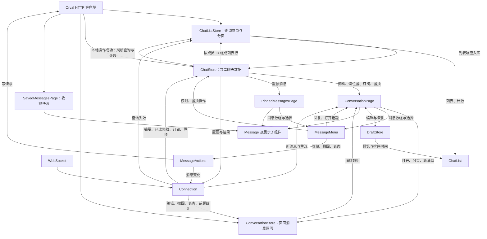

# 数据流

客户端通过生成的 HTTP 客户端和一个 WebSocket 连接访问后端。列表和跨页面资料存于应用共享服务；连续消息区间属于页面；菜单、滚动、表单和操作反馈属于组件。

## 状态所有权

| 所有者                         | 作用域与持有数据                                                                     | 消费者                                            |
| ------------------------------ | ------------------------------------------------------------------------------------ | ------------------------------------------------- |
| SessionStore                   | 应用：token、当前用户                                                                | App、认证拦截器、Connection、用户相关组件         |
| Connection                     | 应用：唯一 WebSocket、心跳、重连和最近 256 个新消息 ID                               | ChatStore、ChatListStore、ConversationStore、页面 |
| ChatStore                      | 应用：聊天资料、最后消息摘要、归档/静音、已读、话题摘要与订阅、按范围缓存的 ChatPins | 列表、对话页面、置顶页面、消息菜单                |
| ChatListStore                  | 应用：各查询的成员 ID、游标、加载/失效状态、消费者；好友请求与归档计数查询           | ChatList                                          |
| DraftStore                     | 应用与 localStorage：按账号及 chatId/threadId 保存文字、回复目标 ID、保存时间        | 列表预览和对话输入                                |
| Preferences                    | 应用与 localStorage：消息页话题开关、全部头像开关                                    | ChatList、页面、设置                              |
| ConversationStore              | 每个 ConversationPage：连续消息区间、双向游标、加载状态、待应用补丁与请求上下文      | 所在页面                                          |
| MessageActions                 | 每个 MessageMenu：收藏、撤回、表态的请求操作；不持有消息缓存                         | MessageMenu                                       |
| ConversationNavigation         | 应用：即时导航指令流，不缓存页面数据                                                 | ChatList 发出，当前 ConversationPage 接收         |
| AppUpdates / PushNotifications | 应用：更新与通知订阅状态                                                             | 设置页面                                          |

组件持有的详细字段和父子传递关系见 [Components](components.md)。

`ChatStore` 不保存所有历史消息。聊天摘要、话题摘要和已读字段各有一份共享状态；列表查询保存成员 ID，并从共享状态派生行对象。`ChatPins` 是 ChatStore 按聊天/话题创建的普通对象，置顶栏、置顶页面和菜单消费同一份集合。

收藏快照只由 `SavedMessagesPage` 持有。`MessageMenu` 从页面传入的消息数组中解析当前选择，不依赖消息区间 Store。

## 协议与本地存储

请求基地址是 `/_api`。`SessionStore.initialize()` 依次检查 URL token、localStorage 和开发预设，执行 `POST /auth/refresh` 与 `GET /users/me`。启动加载和错误由 App 持有，身份就绪后显示业务页面。开发预设的配置见 [README](../README.md)。

业务 ID 使用 `SnowflakeID` 品牌类型：有限、非零、可排序的 number，可以无损表示非负 i64。HTTP 与 WS 响应在边界编码；路由输入使用 `encodeId`，链接和协议输出使用 `decodeId`。普通 UID、计数和日期游标不参与这种转换。

HTTP 和 WS 边界仅转换 ID。可选字段在 TypeScript 中声明为 `field?: T`，响应中的 `null` 原样保留；可选链、空值合并和必要的 `== null` 判断同时适配 null/undefined。0、false 和空字符串仍按其业务含义处理。`UpdateChatBody.avatarImageId` 与 `PatchInviteBody.expiresAt` 显式允许请求 null，用于清除头像和过期时间。生成的 `json-codecs.ts` 只记录需要 ID 转换的路径。

共享聊天缓存保留在本次应用运行的内存中，不按列表可见性逐条回收；连续消息与收藏随页面离开释放。token、展示偏好和草稿保存在 localStorage。Service Worker 缓存应用资源和表情数据，没有 API 数据缓存或离线消息数据库。

## 请求时机

下表省略 `/_api`。`c` 表示 chatId，`t` 表示 threadRootId，`m` 表示 messageId。

### 列表与计数

| 触发条件                           | 请求                                                      | 数据流向                                        |
| ---------------------------------- | --------------------------------------------------------- | ----------------------------------------------- |
| 激活需要聊天的分类，查询已失效     | `GET /chats?limit=50`；归档页加 `archived=true`           | ChatListStore → ChatList；群组/好友由 kind 过滤 |
| 聊天列表续页                       | 同接口加 `after=游标`                                     | 响应更新 ChatStore，成员 ID 合并到同一查询      |
| 激活话题 tab，或消息 tab 开启话题  | `GET /threads?limit=20&archived=false或true`              | ChatListStore → ChatList                        |
| 话题列表续页                       | 同接口加 `before=时间游标`                                | 响应更新 ChatStore，成员 ID 合并到同一查询      |
| 消息/好友分类展示活跃好友请求      | `GET /friends/requests?archived=false`                    | ChatListStore → ChatList                        |
| 打开好友请求历史页                 | `GET /friends/requests?archived=true`                     | 独立历史查询；前端没有续页操作                  |
| 普通分类展示归档角标               | `GET /chats/unread`；需要话题时再取 `GET /threads/unread` | 只激活当前分类消费的计数                        |
| 话题行缺少所属聊天资料             | 每个未缓存 chatId 调用 `GET /group/{c}`                   | ChatStore → 行头像、名称、聊天类型              |
| 下拉刷新、前台恢复、重连或相关推送 | 查询失效；有消费者时请求，无消费者时等待下次激活          | 共享查询及资料缓存                              |

群组与好友分类都显示后端返回的**归档对话未读消息总数**。消息分类在显示话题时叠加归档话题未读消息数；话题分类只显示话题计数。

“已归档”入口在主列表固定存在；好友分类还固定显示“好友请求”历史入口。入口不依赖计数或历史列表成功加载。归档明细和好友请求历史只在进入对应页面时加载。

### 对话与已读

| 触发条件                                     | 请求                                                         | 结果用途                                    |
| -------------------------------------------- | ------------------------------------------------------------ | ------------------------------------------- |
| 进入对话，基础资料无有效缓存                 | `GET /group/{c}`                                             | ChatStore → 标题                            |
| 普通对话恢复，已读状态无有效缓存             | `GET /chats/{c}/unread`                                      | 页面决定打开位置                            |
| 话题恢复，列表无有效读位置                   | `GET /chats/{c}/threads/{t}/read-state`                      | 页面决定打开位置                            |
| 当前话题缺少订阅状态                         | `GET /chats/{c}/threads/{t}/subscribe`                       | ChatStore → 订阅/归档按钮                   |
| 打开消息区间                                 | `GET /chats/{c}/messages?max=50`，按需加 `around=m`          | ConversationStore → 页面消息行              |
| 加载历史/后续消息                            | 同接口加 `before=olderCursor` 或 `after=newerCursor`         | 同一连续消息区间；话题读取均带 `threadId=t` |
| 点击引用、消息链接或置顶预览，目标未在区间内 | 同消息接口加 `around=m`                                      | 精确定位；不存在时保留当前区间并提示        |
| 恢复草稿的回复预览                           | `GET /chats/{c}/messages/{m}`                                | 页面回复预览；读取失败时文字仍可编辑        |
| 页面活跃可见，消息底部进入视口               | `POST /chats/{c}/read` 或 `POST /chats/{c}/threads/{t}/read` | 1 秒合并读目标，响应更新已读状态与角标      |
| 用户标记未读                                 | `POST /chats/{c}/unread`                                     | 与正在发送的已读操作协调，应用后端结果      |
| 位于最新区间时重连                           | 消息接口加 `after=当前最后ID`，最多补一页                    | 其余空隙通过后续分页补齐                    |

页面进入时固定未读边界。短尾部可直接定位最新，较长的未读区间定位到未读分隔线；切换到最新位置或精确消息使用同一页面导航操作。

右下角下箭头优先返回引用跳转的来源消息，否则定位最新；目标消息已在区间内或当前区间已包含最新消息时不重复请求。角标读取 ChatStore 已有的后端未读计数，不复制计数状态。当前普通对话未跟随底部时收到新消息，会通过去重的 `getReadState` 补取未读数；可见消息的已读响应同步更新角标。话题沿用话题列表或标记已读响应中最近取得的计数，尚未取得计数时不显示数字，不额外遍历话题列表。协议没有未读表态的计数、查询和标记已读能力，因此不提供心形导航。

### 消息操作与设置

| 操作                   | 请求与状态归属                                                                                                               |
| ---------------------- | ---------------------------------------------------------------------------------------------------------------------------- |
| 打开消息菜单           | MessageMenu 调用 ChatStore.ensureDetails 和当前 ChatPins.ensure；必要时读取 `GET /group/{c}` 和当前范围的 pins               |
| 读取置顶               | `GET /chats/{c}/pins` 或 `GET /chats/{c}/threads/{t}/pins`；ChatStore 的 ChatPins 持有                                       |
| 置顶/取消置顶          | ChatPins.set 发出同范围 pins 的 POST 或 `DELETE .../pins/{pinId}`，发布置顶变化                                              |
| 收藏                   | MessageActions：`PUT /saved-messages/{m}`                                                                                    |
| 撤回                   | MessageActions：`DELETE /chats/{c}/messages/{m}`，成功后发布消息删除事件                                                     |
| 添加/取消表态          | MessageActions 立即发布个人选择，再 `PUT/DELETE /chats/{c}/messages/{m}/reactions/{emoji}`                                   |
| 查看收藏/续页          | SavedMessagesPage：`GET /saved-messages?limit=50`，续页加 `before=游标`                                                      |
| 取消收藏               | SavedMessagesPage：`DELETE /saved-messages/by-id/{savedId}`                                                                  |
| 发送文字               | 页面：`POST /chats/{c}/messages` 或 `POST /chats/{c}/threads/{t}/messages`；成功结果进入 Connection                          |
| 聊天归档/恢复          | ChatStore：`PUT/DELETE /chats/{c}/archive`；更新列表和计数                                                                   |
| 聊天静音/恢复          | ChatStore：`PUT/DELETE /group/{c}/mute`；更新列表和计数                                                                      |
| 话题订阅               | ChatStore：`PUT /chats/{c}/threads/{t}/subscribe`                                                                            |
| 话题归档/恢复          | ChatStore：`PUT/DELETE /chats/{c}/threads/{t}/archive`                                                                       |
| 接受/拒绝/归档好友请求 | ChatListStore：`POST .../requests/{id}/accept`、`POST .../reject`、`PUT .../archive`；操作后刷新请求列表，接受还刷新聊天列表 |
| 打开/保存好友验证设置  | 表单组件：`GET/PUT /friends/me/settings`                                                                                     |
| 打开设置，检查通知订阅 | PushNotifications：读取浏览器订阅；存在时 `GET /push/subscription-status?endpoint=...`                                       |
| 开启通知               | 浏览器授权、必要时 `GET /push/vapid-public-key`，创建浏览器订阅并 `POST /push/subscribe`                                     |
| 关闭通知               | `POST /push/unsubscribe`，随后取消浏览器订阅                                                                                 |
| 检查更新               | AppUpdates 调用 Angular Service Worker 更新检查，不经过业务 API                                                              |

## 分页与缓存规则

聊天与话题查询对组件提供 `items`、`loading`、`loadingMore`、`hasMore`、`loadedThrough`、`activate`、`refresh`、`loadMore`。游标由各自实现持有。聊天错误使用 `ChatListError` 区分首次读取、已读、近期刷新和续页；话题与好友请求使用错误标志。

查询按普通/归档范围共享成员和进行中的请求。ChatStore 接收列表响应中的数据，查询仅保留成员 ID、分页边界及查询状态。成员关系决定哪些聊天已加载，共享的归档/订阅状态决定它们当前属于哪个范围。最后一个消费者释放时取消列表读取。刷新从第一页读取到已加载的条目数量或列表末尾；结果齐备后整体替换，刷新期间保留内容。

只有“消息”tab 且开启“在消息中显示话题”时使用共同覆盖范围。两个来源记录服务器最后一页覆盖到的时间，未加载为 `Infinity`，加载到底为 `-Infinity`；混合列表展示时间不早于两个边界较新者的行。触底只补覆盖较浅的来源，边界相同则一起补。群组、好友、话题 tab 独立展示和分页。

列表初次显示或切换分类时等待该分类的列表请求结束，已有局部缓存也参与这一等待。后续刷新保留列表节点。固定入口和独立角标不参与首次内容等待。

消息采用普通 DOM 列表，每页最多 50 条，不使用虚拟列表。距离边缘不足 1.5 个视口时预取，同一时间只加载一个方向。历史页等待手指离开且滚动惯性停止后合并，保持首条可见消息底部的视口位置；这一锚点覆盖相同作者分组时作者栏消失的高度变化。媒体尺寸在资源加载前预留，缺尺寸的媒体使用固定回退框。

## 实时事件与一致性

| 事件                                                      | 消费与更新                                                                                                                                                                         |
| --------------------------------------------------------- | ---------------------------------------------------------------------------------------------------------------------------------------------------------------------------------- |
| message                                                   | Connection 对 HTTP 成功与 WS 回声按 ID 去重；ChatStore 更新预览并使已读失效，活跃 ChatListStore 查询补取未读，当前页面筛选所属对话并交给 ConversationStore；是否跟随底部由页面决定 |
| messageUpdated / messageDeleted / messagesBulkDeleted     | ChatStore 更新摘要及已加载的置顶内容；ChatListStore 刷新必要查询；ConversationStore 更新消息区间，进行中的消息读取保留事件补丁                                                     |
| reactionUpdated                                           | ConversationStore 更新消息表态，ChatStore 更新置顶表态；广播未带个人选择时保留已知 reactedByMe                                                                                     |
| pinAdded / pinRemoved / threadPinAdded / threadPinRemoved | ChatStore 按聊天/话题范围更新已缓存的 ChatPins                                                                                                                                     |
| threadUpdate                                              | ConversationStore 更新根消息的话题统计；ChatListStore 刷新话题列表与计数                                                                                                           |
| threadMembershipChanged                                   | 订阅缓存失效，当前话题页面补取订阅状态，列表和话题计数刷新                                                                                                                         |
| friendRequestReceived / friendRequestResolved             | 好友请求查询失效；接受请求还刷新聊天列表                                                                                                                                           |
| chatArchiveStateChanged                                   | 更新聊天归档/静音字段，刷新列表与聊天归档计数                                                                                                                                      |
| friendshipRemoved                                         | 刷新聊天归档计数                                                                                                                                                                   |
| 首次 presenceUpdate、恢复前台                             | Connection 发出 resync，活跃查询刷新，聊天资料失效，当前页面补取需要的数据                                                                                                         |

Connection 维护一条认证连接，每 10 秒发送心跳。重连采用有上限的退避；页面恢复前台时检查连接新鲜度。历史消息区间在重连时不做后台重验，断线期间的编辑、撤回和表态变化可能在重新打开区间后才可见。

`presenceUpdate` 用于连接握手和心跳，没有在线用户列表消费者。`stickerPackOrderUpdated` 经 Connection 转发，界面没有消费该事件。

没有对应推送的信息依靠操作响应、页面进入时的必要读取、手动刷新和 resync 更新。收藏是保存时的快照；好友验证设置进入时读取；展示偏好和草稿为本地数据。表态操作即时更新本地选择，服务端广播更新总数；失败显示操作提示，不额外读取消息详情或自动回滚。

共享字段带有请求版本，较早开始的列表读取不会覆盖较新的消息、已读或订阅结果；后续刷新可以更新这些字段，不设临时覆盖表。已读操作合并目标并串行执行，若 HTTP 读取和推送交错导致计数无法确定，则补取对应聊天/话题的读状态。ChatStore 的本地操作成功事件只通知 ChatListStore 刷新受影响的查询或计数。消息区间中的事件补丁保护进行中的读取结果，不构成全局消息仓库。

## 页面生命周期

App 解析路由并保留桌面侧栏的列表选择；ChatListPage 接收路由输入，向移动端 ChatList 传递 selection 和 active。桌面侧栏只在分栏可见时创建，宽屏下 ChatListPage 不创建移动列表。ChatList 不订阅路由变化。

Ionic 可以保留离开的页面实例。页面离开时重置 ConversationStore、取消消息或收藏读取、清空菜单与当前输入展示。列表页释放查询消费者；共享聊天、读位置和置顶缓存仍可复用，正在读取的共享置顶不因一个页面离开而取消。DraftStore 中的持久草稿保留。组件销毁也执行相应清理。[Ionic 页面生命周期](https://ionicframework.com/docs/angular/lifecycle)

写操作不会因为页面离开而主动取消；组件销毁时由 DestroyRef 结束其请求。异步结果使用上下文或版本检查，防止旧页面操作覆盖新的 UI。MessageMenu.reset 清空菜单、确认和提示，正在结束的旧操作不会向新页面展示结果。

输入和回复选择只保存在 ConversationPage。离开会话、切换聊天或话题、页面进入后台及 pagehide 时，将未发送文字和回复目标保存到 DraftStore；相同内容不重复写入，空内容移除已有草稿。输入过程中不更新聊天列表的草稿预览或排序时间。编辑已发送消息使用独立的 editText，离开时仍只保存未发送内容。发送成功只清除仍对应这条发送请求的草稿，包括请求期间离开或进入后台所保存的内容。列表用消息活动时间与草稿保存时间中的较新者排序，未加载的聊天不会因本地草稿而单独创建列表行。

## 搜索与管理请求

- 聊天列表加号中的搜索把 toolbar 切换为搜索条，300ms 输入防抖后请求 `GET /group`（已加入范围）和 `GET /users/search`。群组用返回的游标分页；用户接口没有分页游标。此入口不搜索所有聊天的消息。
- 聊天资料按需请求 `GET /group/:id`，成员子视图请求 `GET /group/:id/members`；群资料保存后更新 ChatStore，并刷新聊天列表。角色更新、移除成员和退出群组使用现有成员接口。
- 用户资料同时读取好友关系和添加验证方式；只有点击操作后才发送添加、删除或拉黑请求。消息正文中的提及不触发这些请求。
- 邀请预览使用 `GET /invites/invite?inviteCode=...`，点击加入才请求 `/invites/redeem`。邀请码变化会使已有预览失效。邀请列表与创建、撤销、分享使用现有 invites 接口。
- 聊天内搜索使用 `/chats/:id/messages/search` 的 `q`、`sort`、`limit`、`offset`。后端没有全局消息搜索、发送者或日期过滤参数。附件汇总单独使用 `/chats/:id/attachments` 的 `kind` 和消息游标；定位附件时读取原消息，确定是否进入话题。
- 收藏页面按可选 chatId 选择全局收藏或单聊天收藏接口；两种入口共用分页与消息展示。

## 消息输入与上传

MessageComposer 拥有附件与上传任务，VoiceRecorder 子组件管理设备资源。照片先读取上传限制，检测文件类型、尺寸并压缩，再申请签名上传地址；文件入口保留原始字节，不经过照片压缩；PUT 上传直接使用存储返回的签名请求头，不携带聊天登录 token。图片和视频的尺寸在提交消息前确定。移除文件或离开聊天会中止上传并释放本地 URL。取消录音、离开聊天或销毁组件会释放麦克风，过期的授权响应不能重新启动录音。

ConversationPage 接收附件 ID 和消息类型，负责提交与处理响应。文字消息可附带图片和视频；普通文件单独发送且不携带文字，语音消息只包含一个音频附件。发送文件或语音时，未发送的文本和其他类别附件仍保留在输入区。

发送中的预览属于页面局部状态，不加入 ConversationStore；服务器回声到达后隐藏对应预览。相同内容的失败重试复用 clientGeneratedId，改变文本、回复对象或附件会使用新值。HTTP 成功消息继续走 Connection.accept；编辑成功走 messageUpdated 同一更新路径。编辑不会覆盖原本的未发送草稿。

## 测试边界

写操作只在 HTTP mock 或本地后端上测试。需要真实后端时使用本地服务器与开发数据库 `10.198.3.214`，不得对生产服务器执行消息发送、好友关系、邀请、已读或其他写操作。

照片压缩与旧版使用同一流程：长边限制为1920，静态图片依次尝试 AVIF／WebP／JPEG，只有体积低于原文件75%才使用压缩结果；视频通过 Mediabunny 转码，仅在体积低于原文件50%且不丢失轨道时使用结果。GIF、APNG、动态 WebP／AVIF 保留动画；无法直接读取的 HEIC 使用 heic-to 解码。转换失败或编码不可用时回退到原文件，取消则结束任务。压缩与传输共用取消信号，最终上传尺寸和大小来自实际提交文件。

录音仅在明确发送时上传；松手保存的录音留在组件本地，可播放或删除。左移取消、页面离开以及迟到的麦克风授权都不会发送消息。

## 会话资料面板

打开 ChatDetails 时读取 `/group/:id`；私聊另读 `/friends/:uid` 决定是否显示删除好友。资料就绪后，媒体组件读取图片分类第一页；切换视频、文件 tab 才读取对应分类，后续分页使用接口的消息游标。

静音调用 ChatStore.setMuted，经 `/group/:id/mute` 更新共享聊天状态；资料面板优先读取 ChatStore.chatState，聊天尚未进入列表时才使用资料响应的 mutedUntil。列表操作与 websocket 的聊天状态更新会同步反映在面板上。删除好友使用 friends 接口，退群使用 members 接口，均在确认后提交。

话题标题与角标消费 ConversationPage 传入的根消息引用。当前搜索、附件汇总和静音协议作用于所属聊天，资料中媒体标为“所属聊天的媒体”，不假装按话题过滤。

上传测试拦截预签名请求与对象存储 PUT，不向真实 S3 上传。
