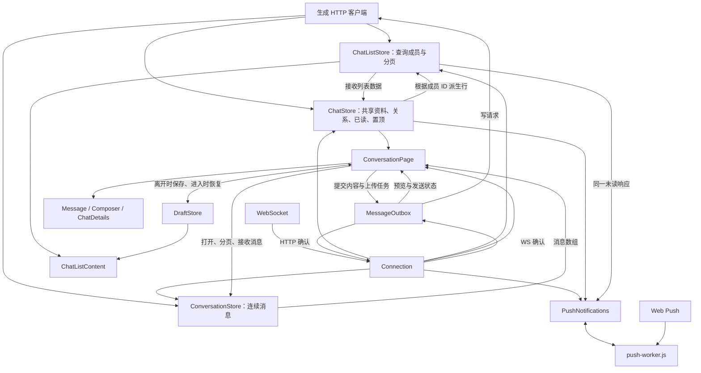

# 数据流

HTTP 使用生成客户端，实时事件来自唯一 Connection。共享资料与列表查询属于应用；连续消息区间属于页面；滚动、表单、搜索结果与操作反馈属于组件。

## 所有权与存储

| 所有者                 | 保存的状态                                                              | 生命周期                             |
| ---------------------- | ----------------------------------------------------------------------- | ------------------------------------ |
| SessionStore           | token、当前用户及用户组                                                 | 应用；token 保存到 localStorage 和 Cookie      |
| Connection             | 唯一 WebSocket、认证/心跳/重连、最近 256 个新消息 ID                    | 应用                                 |
| ChatStore              | 聊天资料、摘要、归档/静音、已读、话题摘要与订阅、好友关系查询、ChatPins | 应用缓存，不保存全部历史消息         |
| ChatListStore          | 查询成员 ID、游标、覆盖范围、消费者、好友请求与共享未读响应             | 应用；无消费者时取消读取             |
| ConversationStore      | 连续消息区间、双向游标、请求状态、期间收到的补丁                        | 每个 ConversationPage；页面离开释放  |
| MessageOutbox          | 已提交内容、编辑/撤回意图、上传、确认与重试                             | 应用内存；跨页面，整页刷新不恢复     |
| DraftStore             | 文字、回复目标 ID、保存时间                                             | 按账号和聊天/话题保存到 localStorage |
| Preferences            | 话题/头像显示偏好、最近表情                                             | localStorage                         |
| MessageActions         | 请求操作，不保存消息缓存                                                | 每个 MessageMenu                     |
| ConversationNavigation | 即时导航指令，不保存消息或位置                                          | 应用；当前页面消费                   |
| PushNotifications      | 本机通知意图、浏览器权限、操作状态、去重记录                              | 应用；本机意图保存到 localStorage    |
| AppUpdates             | 检查更新和可更新状态                                                    | 应用                                 |

ChatPins 是 ChatStore 内部的普通对象，不是额外服务。UserProfile、ChatDetails 和 ConversationPage 共享按 UID 的好友关系查询。收藏由 SavedMessageList 持有快照，不进入活消息缓存。组件字段见[组件](components.md)。

同一对象被多处引用不构成数据副本，不为节省指针改成 ID。ID 用于查询成员、导航目标和需要回到共享状态查找最新内容的地方；不能从服务派生的表单、滚动与搜索状态由组件持有。

## 身份、协议与入口

SessionStore 按 URL token、localStorage、Cookie、开发预设选择身份并移除 URL 中的 token。localStorage 和 Cookie 使用同一个键 `chahua.auth.token`；读取身份及刷新 token 时同步写入两处。Cookie 只属于当前主机，使用 `Path=/`、`SameSite=Lax`，HTTPS 下设置 `Secure`，每次写入续期 400 天。Cookie 过期不影响 localStorage；只有 Cookie 时自动补入 localStorage。退出登录或登录收到 401 时清除两处，网络失败保留凭据供重试。请求仍使用 Bearer token。

iOS/iPadOS 17.2+ 与 macOS Safari 安装网页应用时复制 Cookie，不复制 localStorage；安装后两边存储独立，已安装应用不会收到 Safari 后续的登录变化。更早 iOS 不提供这条安装登录传递；`start_url` 固定为 `/chats`，不携带 token。[WebKit 安装行为](https://webkit.org/blog/14787/webkit-features-in-safari-17-2/#login-cookies)

选定身份后依次 `POST /auth/refresh`、`GET /users/me`、`GET /users/search?q=UID&limit=1`；最后一步补用户组，失败不阻塞登录。后续 HTTP 和 WS 中的本人资料更新共享身份；全局与单聊天收藏快照均不参与更新。待发消息从当前身份派生作者资料，更新资料不重连 WebSocket。

API 基地址为 `/_api`。SnowflakeID 是有意使用的可排序无损 number 编码，HTTP/WS/路由边界编解码，普通 UID 和计数不转换。null/undefined 原样保留；仅 UpdateChatBody.avatarImageId 与 PatchInviteBody.expiresAt 显式允许请求 null 表达清除。JSON 拦截器保留 FormData，二进制上传不按 JSON 转换。

`/landing` 无需登录即可阅读安装指引，仍由 SessionStore 提取 token。已安装应用进入聊天；携带邀请码时进入邀请预览，不自动兑换。其他业务页面由 App 的身份加载/错误状态控制。

Service Worker 缓存应用资源和表情数据，不缓存业务 API。共享聊天数据仅在内存，连续消息随页面离开释放，没有离线消息数据库。

## 何时请求

下表省略 `/_api`，c/t/m 分别表示聊天、话题根和消息 ID。

| 触发                          | 接口与参数                                                             | 消费路径                                    |
| ----------------------------- | ---------------------------------------------------------------------- | ------------------------------------------- |
| 激活聊天分类或续页            | `GET /chats?limit=50`，归档加 archived，续页加 after                   | ChatListStore → ChatStore → ChatListContent |
| 话题 tab，或消息 tab 开启话题 | `GET /threads?limit=20`，archived 与 before 时间游标                   | ChatListStore → ChatStore → ChatListContent |
| 消息/好友列表显示请求         | `GET /friends/requests?archived=false`                                 | ChatListStore → ChatListContent             |
| 打开请求历史                  | 同接口 archived=true；无前端续页                                       | 独立历史查询                                |
| 显示归档计数                  | `GET /chats/unread`；需要话题时读 `/threads/unread`                    | 查询由实际消费者激活                        |
| 缺聊天资料；打开详情或菜单    | `GET /group/{c}`，按缓存新鲜度去重                                     | ChatStore → 标题、资料、权限                |
| 私聊或用户资料缺关系          | `GET /friends/{uid}`                                                   | ChatStore.relationship → 三处共用           |
| 用户资料的验证方式            | `GET /friends/add-info/{uid}`                                          | UserProfile 局部保存                        |
| 恢复普通对话，读状态无缓存    | `GET /chats/{c}/unread`                                                | 页面决定打开位置                            |
| 恢复话题，读状态无缓存        | `GET /chats/{c}/threads/{t}/read-state`                                | 页面决定打开位置                            |
| 话题缺订阅状态                | `GET /chats/{c}/threads/{t}/subscribe`                                 | ChatStore → 订阅/归档按钮                   |
| 打开、定位、双向分页          | `GET /chats/{c}/messages?max=50`，around/before/after；话题加 threadId | ConversationStore → 页面                    |
| 回复预览或话题根缺失          | `GET /chats/{c}/messages/{m}`                                          | 页面局部预览                                |
| 活跃可见消息进入视口          | 普通/话题 read 的 POST，1 秒合并目标                                   | ChatStore 更新读状态和计数                  |
| 置顶栏、置顶页、消息菜单      | 普通/话题范围的 `GET .../pins`                                         | 共享 ChatPins                               |
| 全局或单聊天收藏              | `GET /saved-messages` 或 `/chats/{c}/saved-messages`，limit=50、before | SavedMessageList 快照                      |
| 全局目录搜索                  | `GET /group`（joined）和 `/users/search`，300ms 防抖                   | DirectorySearch；群有游标，用户无游标       |
| 群资料中的成员标签              | `GET /group/{c}/members`，limit、after                                 | ChatMembers 局部分页                        |
| 资料中的话题标签              | `GET /chats/{c}/messages?max=50`，before                               | ChatThreads 筛选 threadInfo 根消息          |
| 资料中的媒体标签              | `GET /chats/{c}/attachments`，kind、limit、before                      | ChatAttachments 局部分页                    |
| 打开媒体或定位附件            | `GET /chats/{c}/messages/{m}`                                          | 当前消息的媒体集合，或所属话题路由          |
| 聊天内消息搜索                | `GET /chats/{c}/messages/search`，q、sort、limit、offset               | ChatSearch 局部分页                         |
| 邀请预览与管理                | `GET /invites/invite?inviteCode=...`、`GET /invites`                   | InviteCard、StartChat、ChatInvites          |
| 查看完整表态                  | `GET /chats/{c}/messages/{m}/reactions`                                | ReactionDetails；按表情本地过滤             |
| 打开贴纸库                    | 收藏、已订阅包、自有包三个 GET                                         | StickerPicker；切包读取该包详情             |
| 好友验证设置                  | `GET /friends/me/settings`                                             | 表单组件                                    |

创建、编辑、归档、订阅、置顶、收藏、好友和群管理等写操作仅由用户动作触发。消息读标记由可见性触发。请求期间的具体反馈见[加载标识](loading-indicators.md)。

## 分页、刷新与页面生命周期

列表查询按普通/归档范围共享成员和进行中的请求；记录成员 ID、游标和覆盖边界，字段从 ChatStore 派生。刷新读取到已加载条目数或末尾，齐备后替换，期间保留现有内容。初次显示或切分类等待当前分类的列表查询，固定入口和归档角标不参与等待。

只有消息 tab 开启话题时才使用两来源共同覆盖范围：未加载边界为 Infinity，末尾为 -Infinity，展示时间不早于两边较新边界的行。触底补覆盖较浅的一侧，相同则同时补。其他分类独立分页。群/好友的归档数字都是后端归档对话未读总数，不遍历归档历史分类型 count。

ThreadParticipants 优先读取 ChatStore 的话题参与者缓存，并合并 ConversationPage 经 ChatDetails 传入的已加载话题消息作者；缺少缓存时标明名单仅覆盖已加载范围，不额外读取历史。SavedMessagesPage 与 ChatDetails 共用 SavedMessageList，收藏范围是整个所属聊天；独立页面离开时销毁列表，重新进入时重新读取。

资料列表的游标与请求属于各组件，切换标签后释放；使用 Ionic infinite-scroll；成员、媒体和搜索首屏不足一屏时 fillScrollViewport 继续补页。ChatThreads 的游标来自原始消息响应，不从筛选结果推算；只由触底触发续页，空话题页不连续扫描历史，结果不限订阅状态。搜索与媒体汇总作用于所属聊天。

连续消息每页最多 50 条，使用普通 DOM。接近边缘 1.5 个视口时预取，一次一个方向；手指离开且惯性结束后才合并历史，以首条可见消息底部为锚。媒体预留尺寸。浮动日期复用同一滚动状态和可见消息测量。

Ionic 会缓存页面实例。完成离开时清理连续区间、局部输入、菜单和读取；仅在真正离开后执行，允许取消 iOS 返回手势。列表释放查询消费者，共享资料/置顶仍可复用。局部读取和查询消费者随页面释放。已发出的资料写操作仍可更新原聊天的共享数据，界面收尾只作用于原范围；菜单等使用 takeUntilDestroyed 的请求随组件销毁结束订阅，MessageOutbox 则跨页面继续。异步结果使用请求版本或进入上下文，旧结果不能覆盖新页面。[Ionic 生命周期](https://ionicframework.com/docs/angular/lifecycle)

分栏下 App 持有 sidebarSelection，分类切换不改路由；单列分类共用 ChatListPage，通过无组件的子路由保留分类地址与浏览器历史。ChatList 使用原生 segment-view 切换 ChatListContent，各分类保留自己的滚动位置，只有当前分类激活查询和续页。设置沿用 `/settings` 浏览器地址，内部保留底层聊天路由。ConversationNavigation 只用于已打开会话的即时定位，不保存第二份导航状态。

## 实时事件与未推送的数据

| 事件                                                      | 更新路径                                                                                              |
| --------------------------------------------------------- | ----------------------------------------------------------------------------------------------------- |
| message                                                   | Connection 合并 HTTP 与 WS 回声并去重；ChatStore 更新摘要、使已读失效；当前页面决定接收和是否跟随底部 |
| messageUpdated / messageDeleted / messagesBulkDeleted     | 更新摘要、置顶与已加载区间；正在读取的区间保留补丁                                                    |
| reactionUpdated                                           | 更新区间与置顶表态，保留广播缺省的个人选择                                                            |
| pinAdded / pinRemoved / threadPinAdded / threadPinRemoved | 更新已缓存的 ChatPins                                                                                 |
| threadUpdate                                              | 更新根消息统计，刷新活跃话题列表与计数                                                                |
| threadMembershipChanged                                   | 订阅失效，当前页面补读，列表和计数刷新                                                                |
| friendRequestReceived / friendRequestResolved             | 请求列表失效；接受时刷新聊天，相关好友关系查询失效                                                    |
| friendshipRemoved                                         | 刷新相关关系查询和聊天归档计数                                                                        |
| chatArchiveStateChanged                                   | 更新归档/静音字段，刷新受影响列表与计数                                                               |
| 首次 presenceUpdate、恢复前台                             | Connection 发出 resync；活跃查询刷新，当前页面补必要元数据                                            |

Connection 每 10 秒心跳、退避重连；connected 在鉴权后的 presenceUpdate 为真。presenceUpdate 无在线用户列表消费者，stickerPackOrderUpdated 也无界面消费者。重连时最新区间至多补一页，不扫旧历史；离线期间编辑/撤回/表态可能在重开区间后才更新。

没有推送的数据靠本地写响应、页面进入、手动刷新或 resync。好友验证配置进入时读取；贴纸库进入时读取；创建贴纸包直接使用完整响应，上传后只重读该包。静音和远端已读没有专门跨设备推送，不增设轮询。较早开始的读取不能覆盖较新推送或本地操作；已读交错时补取对应读状态，不猜增减值。

## 输入、草稿与队列

输入和回复选择属于 ConversationPage，Composer 持有未提交上传任务。离开、切换会话、后台和 pagehide 才写 DraftStore；相同内容不重复写，空内容删除。编辑已发送消息使用独立文本。提交成功入队即清空对应草稿，迟到的确认不碰新输入。列表按消息活动与草稿保存时间的较新者排序，不为未加载聊天创建草稿行。

附件选择后立刻处理和上传；发送时把任务引用移交 MessageOutbox，立即上屏并释放输入区。编辑借用原任务，取消编辑不取消队列上传。文件、语音、贴纸单独发送时保留其他输入内容。已知私聊不可发送时，点击提交说明原因并保留文本、附件和录音；关系未知时交给服务器最终判断。

附件准备不占发送顺序；准备好后与文字共用每会话（chatId + threadId）的串行发送。前一条等待确认时暂停后续提交，失败后放行下一条；不同聊天/话题独立。创建请求发出后冻结正文、附件 ID 与 clientGeneratedId，重试使用原请求。编辑已发请求需先取得 ID，再 PATCH；未发请求的编辑直接修改待发内容。

撤回立即隐藏并停止创建重试，dispose 附件任务；尚未发请求可直接删除。已发请求保留撤回意图，迟到响应、WS 或正常加载取得对应 ID 后补 DELETE。协议不能按 clientGeneratedId 查询/撤回，不扫历史兜底。队列关闭或整页刷新不持久化。

本地与确认回声按 clientGeneratedId 保持行身份。已接受但尚未发布的语音继续用本地音频；WS、列表或后续 GET 确认发布后再换服务器附件。此时 GET 的 404 不触发重新创建。

## 媒体与语音

上传先读取限制，照片入口检测/压缩后申请签名 URL；文件入口保留原字节。签名 PUT 使用返回头，不携带聊天 token。AttachmentUpload 持有进度、AbortSignal、本地 URL 和成功 ID；重试复用已有任务/ID，释放时取消处理与上传。

静态图片长边限制 1920，尝试 AVIF/WebP/JPEG，低于原体积 75% 才采用；视频通过 Mediabunny 转码，低于原体积 50% 且轨道完整才采用。保留动图，HEIC 必要时解码，编码失败回退原文件。浏览器已启动的不可取消编码结束后丢弃结果，不再上传。

录音保存阶段只留本地 Blob，明确发送才上传。VoicePlayer 点击后同步启动 Audio 保留 Safari 用户激活，WaveSurfer 读取真实波形；波形 CORS 失败不影响可用播放，同一时间只播放一条。MediaViewer 仅浏览当前消息的图片/视频，不合并整聊天媒体。

## 通知与静音

App 在会话初始化并确认登录后启动 PushNotifications。在线 WebSocket 优先，前后台页面均直接让 Worker 展示系统通知，未运行时由 Web Push 兜底。各平台与分栏布局共用同一流程；前台正在阅读对应会话且未被设置或 modal 覆盖时，只登记去重，不展示通知。

NotificationPrompt 在登录后的应用壳内读取本机通知选择；支持通知且选择不存在时显示 Ionic alert，不根据已有的浏览器授权推断用户选择。拒绝立即保存关闭并结束弹窗；允许在点击事件内调用 PushNotifications，授权和推送登记成功后结束，失败保留重试。弹窗等待状态由组件持有。

设置行不等待异步请求。PushNotifications 同步检查浏览器 API 与 Worker 配置，读取 `chahua.notifications.enabled` 和 `Notification.permission`；本机关闭直接显示关，开启且已授权显示开。ChatList 在头像点击事件内调用 requestSettingsPermission，在导航之前为本机已开启但权限为 default 的场景申请权限。拒绝、关闭权限弹窗或无手势直接进入设置且缺授权时，保存关闭选择；Settings 的 refresh 不打断已开始的授权。

启动、进入设置，以及 Connection 在重连或恢复前台时发出的 resync，通过 refresh 在后台同步订阅；没有本机选择或环境不支持时不继续。开启且已授权时，读取浏览器当前订阅，缺少则取得 VAPID key 并创建订阅，再直接调用 `/push/subscribe` 更新当前 endpoint 的登记，不额外查询后端登记状态。后台检查无等待标识、失败静默；权限仍为 granted 时保留本机开启选择和已创建的 endpoint，下一次 refresh 重试，在线系统提醒不受登记失败影响。

关闭立即保存本机意图并清除已显示的通知，再调用 `/push/unsubscribe` 和浏览器取消订阅；后端请求失败仍尝试浏览器取消。订阅操作按顺序执行并读取最新选择，后台登记进行中关闭会在该请求结束后清理。未增加持久重试队列；浏览器取消成功但后端未删除的过期 endpoint，由后端投递失败时清理。用户主动开关才设置 busy 并展示错误；后台操作不占用开关。

规则读取 ChatStore：自己、系统和已撤回消息不提醒；普通提及绕过静音，回复自己可绕过归档。话题按订阅/归档判断，提及是例外，父聊天归档仍优先。缺元数据只补必要详情/订阅，不扫描归档历史。

Worker 串行处理页面与 Push，按消息 ID 去重，保留最近 512 个 ID，重启从通知中心恢复；已关闭通知不持久保存去重记录。已读按聊天/话题确认边界清理，撤回按 ID 清理；最近 256 个读范围抑制迟到通知。点击导航至 `?message=ID`，复用当前应用以保留队列。

ChatListStore.unread 的完整响应同时服务归档数、系统角标和后台标题，不额外相加话题/静音/归档计数。支持角标或标签隐藏时激活同一查询；前台恢复普通标题。

ChatMute 提供 1 小时、8 小时、1 天、7 天和永久，调用 `/group/{c}/mute`；永久省略 durationSeconds。一个到期定时器更新标志与计数，取消静音按协议同时取消归档。话题使用自身订阅/归档操作。

测试拦截 HTTP、WebSocket 与上传。禁止向生产服写入或测试上传 S3；必须实测写入时使用本地后端及开发数据库 `10.198.3.214`。
