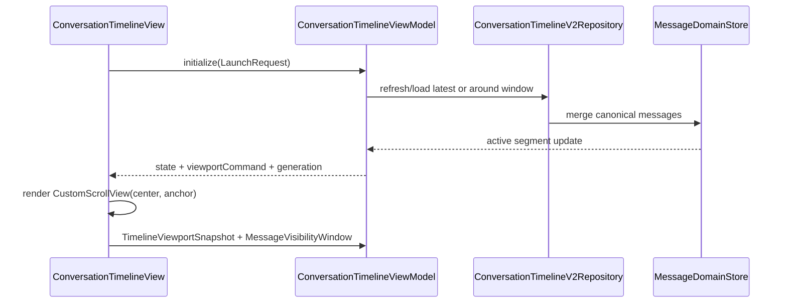

# Conversation Timeline View / VM Contract

## Purpose

This document explains how `ConversationTimelineView` and
`ConversationTimelineViewModel` cooperate to keep the chat timeline stable.

The short version:

- the view owns Flutter scroll mechanics and render-object measurement
- the VM owns conversation data policy and one-shot viewport effects
- the repository/store own message fetching, merging, and canonical ordering

The view should not decide which data window is active. The VM should not read
render boxes or mutate a `ScrollController`.

## Runtime Loop

## View Responsibilities

`ConversationTimelineView` owns the physical viewport:

- render `beforeMessages.reversed`, center seam, and `afterMessages`
- keep the `CustomScrollView(center, anchor)` model
- measure row render boxes after layout
- report `TimelineViewportSnapshot` to the VM
- report `MessageVisibilityWindow` for read-state and related consumers
- execute viewport effects from the VM exactly once per generation

`settleToLiveEdge` is deliberately non-animated. It is a small post-layout
correction for live-edge maintenance, not a user-facing jump.

The view may correct viewport-size changes locally when the measured snapshot
says the user is near live edge but the tail is no longer pinned. This handles
keyboard/safe-area resize timing without waiting for an incidental VM rebuild.

## VM Responsibilities

`ConversationTimelineViewModel` owns timeline policy:

- choose latest, unread, or around-message active segment modes
- split canonical messages into `beforeMessages` and `afterMessages`
- ask the repository to load older/newer/latest/around windows
- decide when a viewport effect should be emitted
- keep data freshness separate from viewport position

Important distinction:

- `segment.isLatestSlice` means loaded data reaches the latest tail
- `snapshot.isNearBottom` means the user is close enough to follow live edge
- `snapshot.viewportAtLiveEdge` means the rendered tail is visually pinned

Do not use a near-bottom boolean as proof that the viewport is pinned.

## Live-Edge Policy

When the active segment is latest and the latest snapshot is near bottom, data
changes should keep the tail visible. This covers:

- a new message appended at the tail
- the latest row changing height, such as reactions appearing
- a row above the latest changing height

When the user scrolls away, the VM must not immediately publish a settle effect
just because the snapshot is still within the near-bottom threshold. User scroll
is intent. Data and viewport-size changes are the events that can request
live-edge correction.

## Future Anchor Work

`TimelineViewportAnchor.viewportDy` is intentionally viewport-local. It exists
for future anchor-preserved pagination and jump resolution:

- capture a stable row key and its viewport-local y before mutation
- load or replace messages
- restore that same row to the same viewport-local y

The current live-edge slice does not use stable-key plus `dy` correction for
ordinary user scrolling.
